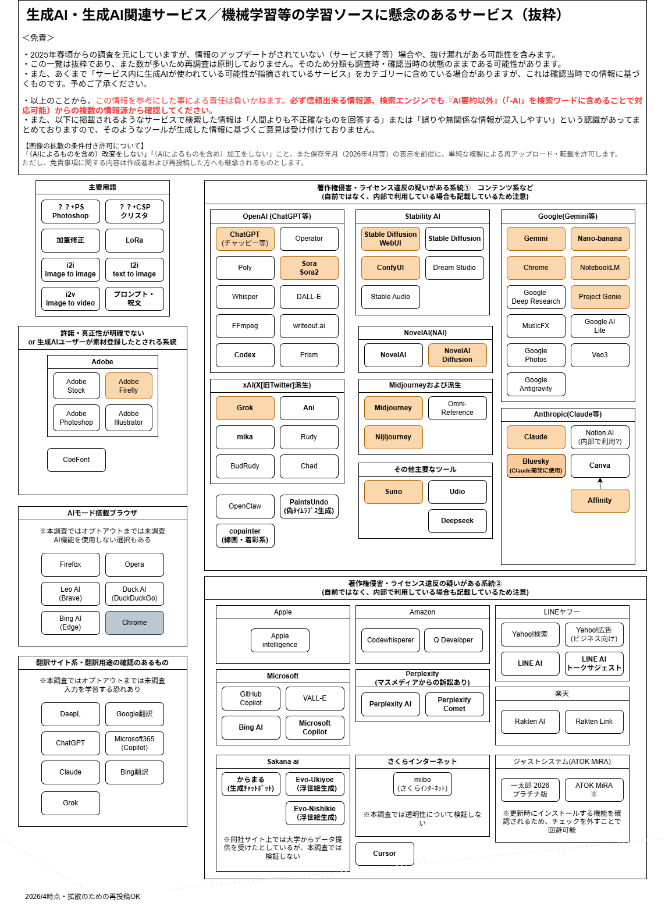

# 著名サービスの展開する生成AI（周辺）サービスリスト

[→下記以外の生成AIサービスリスト](./gen_ai_service_list.md)

---

|AI系統／関連企業|名前|A:画像|B:AIｺﾝﾊﾟﾆｵﾝ|C:AIｴｰｼﾞｪﾝﾄ|D:文章/AI要約|E:動画|F:音楽/音声|G:コード/ﾌﾟﾛｸﾞﾗﾑ|H:その他|備考|
|:---|:---|:---:|:---:|:---:|:---:|:---:|:---:|:---:|:---:|:---|
|Adobe Stock|Adobe Firefly|○| | | |○| | | |注意用語: i2i(image to image) (Adobe)|
|Adobe Stock|Adobe Photoshop(PS)|○| | | | | | | |Adobe Stock,背景拡張など (Adobe)|
|Amazon|Amazon CodeWhisperer| | | | | | |○| | (Amazon)|
|Amazon|Amazon Q Developer| | |○| | | |○| | (Amazon)|
|Apple|Apple intelligence|○| | |○| | | | |iOS 18.4以降 (Apple)|
|Perplexity|Perplexity AI| | | |○| | | | |要約系AI：日本の新聞社と係争中|
|Perplexity|Perplexity Comet| | |○|○| | | | |AIｴｰｼﾞｪﾝﾄﾌﾞﾗｳｻﾞ|
|Suno|Suno| | | | | |○| | | (Suno)|
|NovelAI|NovelAI|○| | | | | | | |アニメ風データ流出(2022) (Anlatan)|
|Canva|Canva|○| | | | |○| | |t2i (Canva)|
|ChatGPT/OpenAI|ChatGPT|○| | |○| | | | | (OpenAI)|
|ChatGPT/OpenAI|DALL-E|○| | | | | | | | (OpenAI)|
|ChatGPT/OpenAI|FFmpeg| | | |○|○| | | |OpenAI Whisperを利用|
|ChatGPT/OpenAI|Operator| | |○| | | | | | (OpenAI)|
|ChatGPT/OpenAI|Poly| | | | | | | |○|3Dモデル|
|ChatGPT/OpenAI|Sora/Sora2| | | | |○| | | |注意用語: i2v(image to video)|
|ChatGPT/OpenAI|Whisper| | | |○| |○| | | (OpenAI)文字起こし機能|
|ChatGPT/OpenAI|writeout.ai| | | |○|○| | | |OpenAI Whisperを利用|
|Claude|Claude| | | |○| | | | |技術記事系コミュニティで散見 (Anthropic)|
|Claude|Notion AI| | | |○| | | | |GPT,Claude系(有料)|
|DeepSeek|DeepSeek|○| | | | | | | |Baidu(百度)導入 (DeepSeek)|
|Discord(サードパーティー)|(Discord)|○| | |○| | | |○|bot/API経由でChatGPT・SDなど|
|Google|Android版Chrome| | | | | | | | |AIモード|
|Google|Google AI Lite|○| | |○| | | | |GeminiのLite版|
|Google|Google Genimi|○| | |○| | | | |「-ai」でオフ (Google)/アプリあり|
|Google|Google Photos|○| | | |○| | | |静止画→動画ツール|
|Google|Google.com（検索）| | | |○| | | | |AIモード|
|Google|MusicFX（旧MusicLM）| | | | | |○| | | (Google)|
|Google|Nano-banana|○| | | | | | | | |
|Google|Veo 3| | | | |○| | | |Google|
|LINEヤフー|LINE AI|○| | |○| | | | |ChatGPT利用 (LINEヤフー)|
|LINEヤフー|LINE AI トークサジェスト| | | | | | | |○|ChatGPT利用? (LINEヤフー)|
|LINEヤフー|Yahoo!検索| | | |○| | | | |(ChatGPT利用?) (LINEヤフー)|
|LINEヤフー|Yahoo!広告|○| | | | | | | |画像拡張生成 (LINEヤフー)|
|Microsoft|Bing(追加機能)| | | |○| | | | | (Microsoft)|
|Microsoft|GitHub Copilot| | | | | | |○| | (Microsoft)|
|Microsoft|Microsoft Copilot|○| | |○| | | | |AIオフ可能/GPT-5が統合|
|Microsoft|VALL-E| | | | | |○| | |名前は似ているが音声系 (Microsoft)|
|Midjourney|Midjourney|○| | | | | | | | (Midjourney)|
|Midjourney|Niji journey|○| | | | | | | | |
|Midjourney|Omni-Reference|○| | | | | | | |Midjourney機能|
|Sakana ai(Google出身者)|からまる|○| | | | | | | |Google出身者 (Sakana ai)|
|Stability AI|AnimateDiff| | | | |○| | | |StableDiffusion拡張|
|Stability AI|ComfyUI|○| | | | | | | |t2i/i2i|
|Stability AI|ComfyUI FramePackWrapper PlusOne|○| | | | | | | |個人開発|
|Stability AI|ComfyUI+CSP|○| | | | | | | |[補足]ComfyUI(SD系)+クリスタ AI加筆|
|Stability AI|ComfyUI+PS|○| | | | | | | |[補足]ComfyUI(SD系)+Photoshop AI加筆|
|Stability AI|DreamStudio|○| | | | | | | | |
|Stability AI|FastComposer| | | | |○| | | |StableDiffusion拡張|
|Stability AI|Image Generator|○| | | | | | | |ChatGPT機能|
|Stability AI|IP-Adapter|○| | | | | | | |StableDiffusion拡張|
|Stability AI|PhotoMaker|○| | | | | | | |StableDiffusionカスタマイズ|
|Stability AI|SD+CSP|○| | | | | | | |[補足]Stable Diffusion(SD)+クリスタ AI加筆|
|Stability AI|SD+PS|○| | | | | | | |[補足]Stable Diffusion(SD)+Photoshop AI加筆|
|Stability AI|Stable Audio| | | | | |○| | | |
|Stability AI|Stable Diffusion(SD)|○| | | | | | | |t2i/i2i/Lora (Stability AI)|
|X/xAI|Ani,Rudy,BudRudy,Chad(Grok)|○|○| |○|○|○| | |3Dアバター等の流出の疑いあり|
|X/xAI|Grok|○| | |○|○|○| | |現xAI(旧X,Twitter)|
|X/xAI|Grok|○| | |○|○| | | |現xAI(旧X,Twitter)動画生成は現状示唆のみ (xAI(旧X,Twitter))|
|さくらインターネット|miibo 国産基盤パッケージ| | |○|○| | | | |さくらの生成AIプラットフォームと連携/セキュリティは意識している？|
|ブラウザ系|Firefox(AIスマートタブ機能)| | | | | | | |○| |
|ブラウザ系|Opera|?| | |○| | | | |ChatGPT連携(2023～)|
|ブラウザ系|Opera Neon| | |○|○| | | | |AIｴｰｼﾞｪﾝﾄﾌﾞﾗｳｻﾞ|
|楽天|Rakuten AI/Rakuten Link| | |○| | | | | | |

## 凡例

- ●：公式や特集記事等で確認
- ▲：将来的に可能になることが示唆される
- ◆：サードパーティーツール経由でほかの生成AI利用

## 頻出語

- t2i: Text to(2) Image プロンプト（命令）から画像生成
- i2i:Image to Image 参照画像＋プロンプトで画像改変生成
- i2v:Image to Video 参照画像＋プロンプトで動画生成

## 補足

(Discordはサードパーティーアプリやbot等を、導線を設けているとされていますが、本体に乗っているかは不明です）  

※本画像(または本ページ)は、**生成AIを不意に触ることのないよう**名称と種類の周知の目的のため作成しています。  
※抜粋ですので、参考程度にしていただき、肯定・否定のための意見への利用を禁じます。  
※今後も動向を踏まえて更新していきます（制作の都合で入れ替えになる場合もあります。過去画像も参照ください）

Ver:2025/10/07, 文責: @eeimend0kusai
